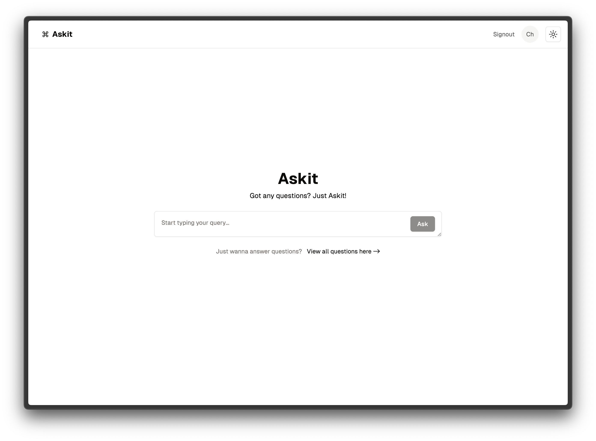
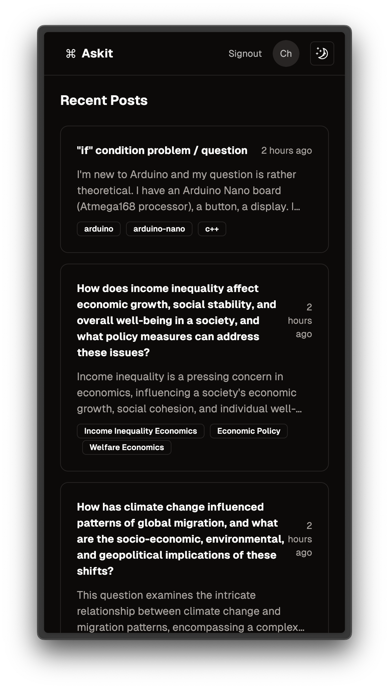
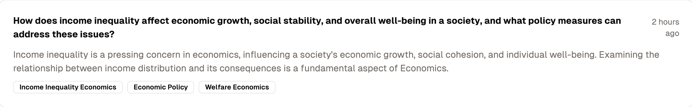
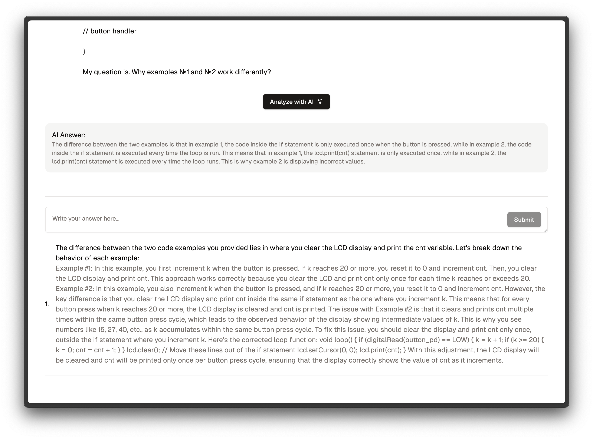
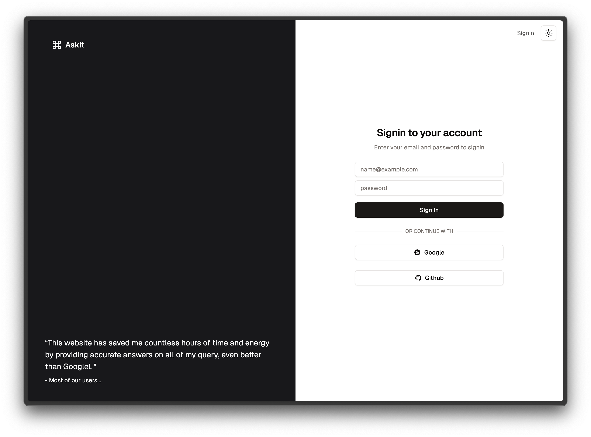
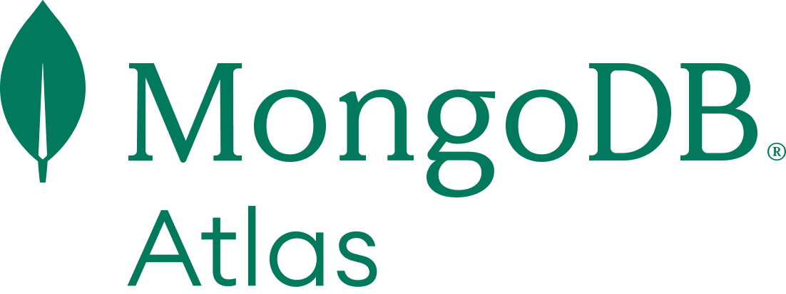
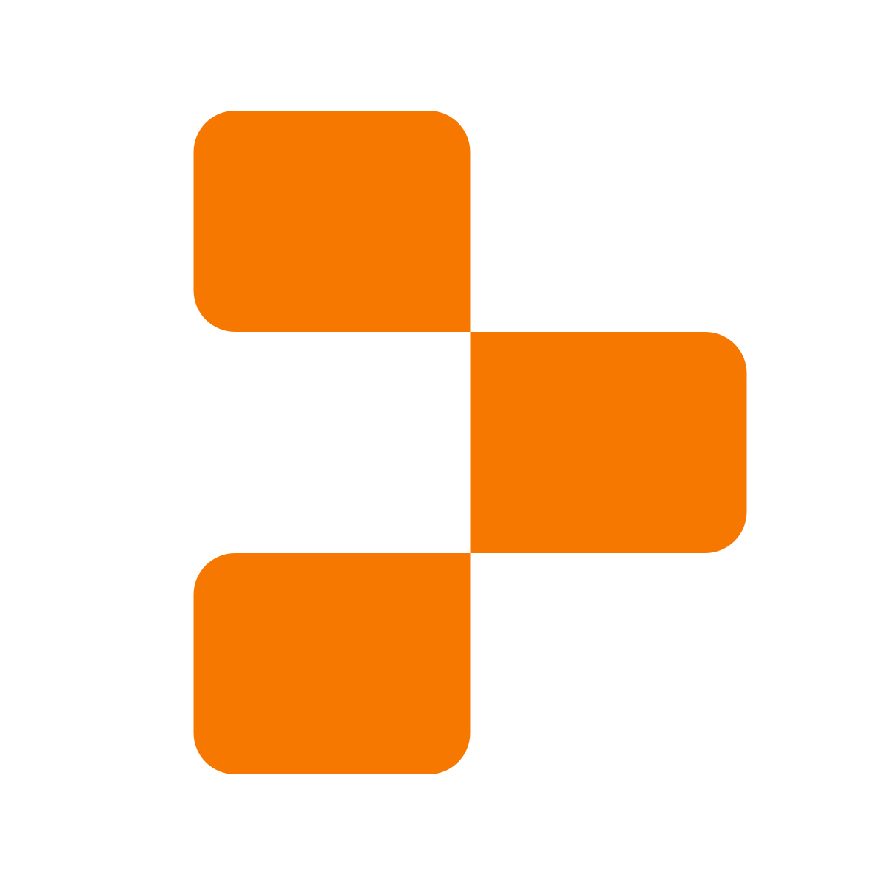

|  |  |
| :-----------------------------: | :---------------------------: |

🚀 **ASKIT** is a cutting-edge community-driven Q&A platform that leverages Artificial Intelligence to expand the
horizons of knowledge sharing beyond technology. It caters to a diverse range of categories, providing users with a rich
tapestry of wisdom. ASKIT is built with a tech stack comprising **T3-stack**, **Next.js**, **NextAuth.js**, **Prisma**,
**Tailwind CSS**, and **tRPC**.

- [🚀 Demo](https://www.askit.study/)
- [🤝 Contributing Guidelines](CONTRIBUTING.md)
- [📜 License](LICENSE.md)

## Table of Contents

- [Table of Contents](#table-of-contents)
- [✨ Features](#-features)
- [Getting Started](#getting-started)
  - [🛠️Prerequisites](#️prerequisites)
  - [Installation](#installation)
    - [Next Auth](#next-auth)
    - [GitHub OAuth](#github-oauth)
    - [Google OAuth](#google-oauth)
    - [OpenAI API Key](#openai-api-key)
- [🌟Usage](#usage)
- [Dependencies](#dependencies)
- [🤝Contributors](#contributors)
- [📋 License](#-license)

## ✨ Features

- **Diverse Categories:** ASKIT offers a wide variety of categories, not limited to just tech. Users can find answers to
  their questions on topics ranging from technology to arts, science, and more.



- **AI-Powered Search:** Our AI-driven search engine makes it easier to find relevant answers quickly.



- **Secure Authentication:** We use NextAuth.js for secure and customizable authentication.



- **Efficient Data Handling:** Prisma ensures efficient data handling and database operations.

- **Modern UI:** ASKIT boasts a clean and user-friendly interface powered by Tailwind CSS.

- **APIs:** We use tRPC for efficient and type-safe API communication.

## Getting Started

### 🛠️Prerequisites

- Node.js
- NPM or Yarn or PNPM
- Your favorite code editor

### Installation

1. Clone the repository:

   ```bash
   git clone https://github.com/ChiragAgg5k/askit
   cd askit
   ```

2. Install dependencies using your favorite package manager:

   ```bash
   npm install
   # pnpm install
   # yarn install
   ```

3. Create a .env file in the root directory with the following environment variables and values:

#### Prisma

- #### Specify the database connection string in the `DATABASE_URL` environment variable in the `.env` file:

```bash
DATABASE_URL="file:./db.sqlite"
```

#### Next Auth

- #### You can generate a new secret on the command line with:

  ```bash
  openssl rand -base64 32
  ```

  More info [here](https://next-auth.js.org/configuration/options#secret).

- #### NextAuth URL, specify the URL of your application for signing in and callback URLs
  ```bash
  NEXTAUTH_URL="http://localhost:3000"
  ```

#### GitHub OAuth

```bash
GITHUB_CLIENT_ID=""
GITHUB_CLIENT_SECRET=""
```

#### Google OAuth

```bash
GOOGLE_CLIENT_ID=""
GOOGLE_CLIENT_SECRET=""
```

#### OpenAI API Key

```bash
OPENAI_API_KEY=""
```

4. Migrate the database:

   ```bash
   npm prisma migrate dev
   ```

5. Run the development server:

   ```bash
   npm run dev
   # pnpm run dev
   # yarn dev
   ```

   Your ASKIT instance should now be running at http://localhost:3000.

## 🌟Usage

Visit the ASKIT website [here](https://www.askit.study/).
Sign in or create an account.
Ask any question on any topic you would like, if it exists you will be redirected to the question page, if not you will
be redirected to the create question page.
Ask questions, provide answers, or upvote and comment on existing posts.

## Dependencies

- [T3-stack](https://create.t3.gg) - A fullstack template for Next.js, Prisma, and NextAuth.js
- [Next.js](https://nextjs.org/) - The React Framework with Hybrid Static & Server Rendering\*\*\*\*
- [NextAuth.js](https://next-auth.js.org) - Authentication for Next.js
- [Prisma](https://www.prisma.io/) - Next-generation ORM for Node.js and TypeScript
- [Tailwind CSS](https://tailwindcss.com/) - A utility-first CSS framework for rapid UI development
- [tRPC](https://trpc.io/) - End-to-end typesafe APIs made easy

- [Mongodb Atlas](https://www.mongodb.com/cloud/atlas) - Cloud database service 

- [Replit (Optional)](https://replit.com/) - Online IDE, project deployed [here](https://replit.com/@ChiragAggarwal/askit) 

## 🤝Contributors

The project was a team effort as part of the [HackCBS 6.0](https://hackcbs.tech/) hackathon, India's largest Student run
hackathon! The team members are:

- Chirag Aggarwal - [Github](https://github.com/ChiragAgg5k/)
- Shivangi Tripathi - [Github](https://github.com/ShiviTripathi13/)
- Divesh Saini - [Github](https://github.com/divesh0001/)
- Krish - [Github](https://github.com/krishrajput1107)

We all represented our college, [Bennett University](https://bennett.edu.in/), at the hackathon.

## 📋 License

This project is licensed under the [MIT License](LICENSE.md) License - see the LICENSE file for details.
